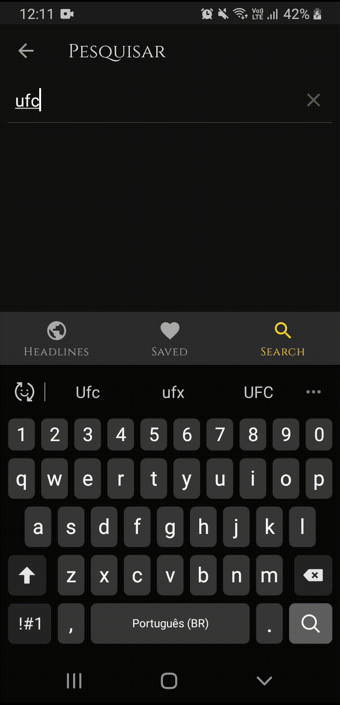

# Breaking News App

Breaking News App é um aplicativo que apresentas as últimas notícias do Brasil e do mundo.

   

A criação teve como intuído a evolução do conhecimento pessoal, consumindo uma API chamada News API (https://newsapi.org/) e ultilizando as seguntes tecnologias:

- Retrofit
- Coroutines
- Arquitetura MVVM
- JetPack Navigation
- viewBinding

